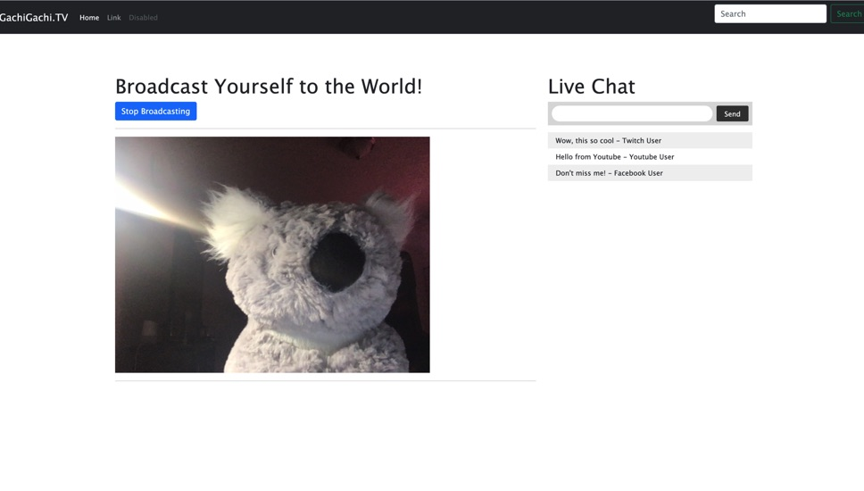
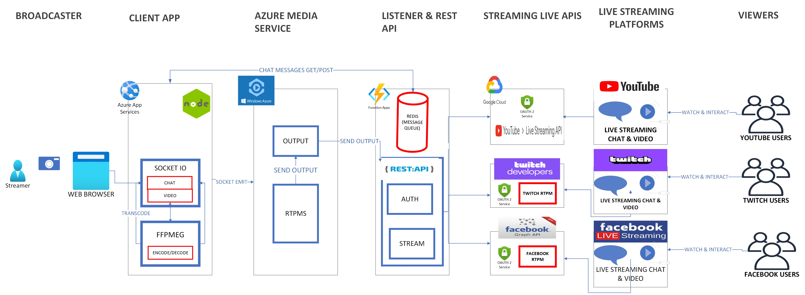

# Universal Simulcasting Platform

> This was developed as a part of T-Mobile 2021 Hackathon. See the [DevPost Submission](https://devpost.com/software/simulcasating) and [video submission](https://youtu.be/TR-pAaq4l3w) 

## Overview

The vision for this **Universal Simulcating Platform** will present an user with an interface where a **streamer** can click a button to stream to multiple live stream endpoints, which can be Youtube, Facebook, Twitch, Vimeo, etc.

In addition, there will be a live chat feeds where it can also get the live chats from different streaming media (Youtube, Facebook, Twitch, Vimeo, etc), and the **streamer** can interact audiences from different channels in this one platform.

## How it was built

An app created with NodeJS + ExpressJS + Socket IO backend was deployed to Azure App service. From this client side, there are two main functions: (1) Video that goes live to different channels (Youtube, Facebook, Twitch, Vimeo, etc) with a single "Start Broadcasting" button click (2) Chat messages that aggregate the messages from different live stream channes

When the "streamer" hit "Start Broadcasting" button, few things will happen. This will encode the video through **FFMPEG** and execute SOCKET IO. After processing the video, this will make a call to Azure Media Service through **Real-Time Messaging Protocol (RTMPS)** endpoint and it will simultaneously make the call to another app service based on REST API. This will authenticate with different streaming services then send the output to different streaming channels.

For the chat, there will be a messaging queue like Redis that aggregates and manages chats coming from audiences on different live streaming channels and displays back to the "streamer". The "streamer" can also broadcast the message through the "unified simulcasting portal" chat window, which will then send out to different live streaming channels.

## How to run

As a prerequisite, **NPM** with **NodeJS** has to be installed.

To run locally, one has to run the following commands:

### STEP 1: Build with NPM

This command just has to run just once. `cd` into the directory and run the following command.

`npm install`

### STEP 2: Start the server

Run this command to launch the server locally.

`npm start`

### STEP 3: Visit the URL and see the app in action

Visit the `localhost:8080` in your browser and see your app in action

## How to deploy to Micrsoft Azure

This app can be deployed to an **Azure App Service** to access remotely. To make it super easy, it recommended to install **Azure App Service** plugin for **Microsoft Visual Studio Code**. From there, one can just login to Azure and click **Upload** icon to deploy as a new app.

## Where to go next

This app was meant to be integrated with **Azure Media Service** to be broadcasted directly from the platform, but this was never achieved. In addition, there should be an integration with other live streaming platforms like Youtube, Facebook, Twitch, etc. 
